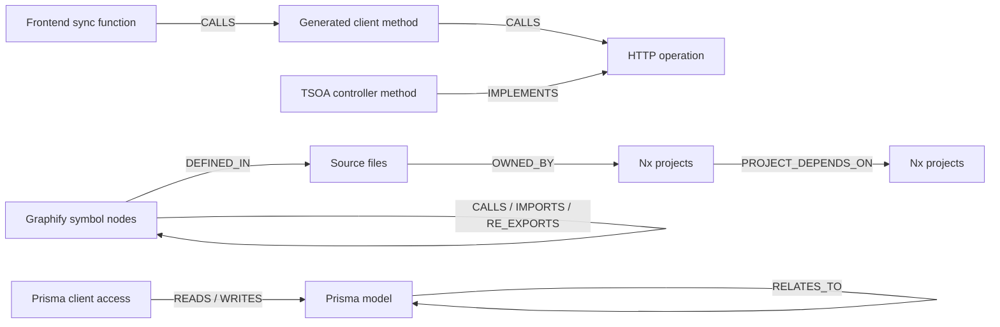

# Graphify improvements for the MyOrganizer monorepo

- **Date:** 2026-08-15
- **Repository revision:** `96249a49489824df2870dc23da0e25f190c05f2c`
- **Graphify version:** `0.9.43`

## Executive conclusion

The full Graphify build does not show that MyOrganizer is poorly structured. It shows that one
mixed-purpose, undirected graph is being asked to represent several different systems at once:
source structure, runtime calls, Nx project dependencies, generated contracts, documentation,
tests, agent workflows, and visual assets.

The current AST extraction is substantially better than the original Graphify `0.8.42`
evaluation. In particular, TypeScript path aliases now resolve correctly. Projecting the live
Graphify import graph onto Nx project ownership reproduced all 84 Nx static dependencies, with one
additional symbol-provenance edge through a barrel:

| Measurement                            | Result |
| -------------------------------------- | -----: |
| Graphify projected cross-project edges |     85 |
| Nx static project dependencies         |     84 |
| Intersection                           |     84 |
| Precision                              |  0.988 |
| Recall                                 |  1.000 |
| $F_1$                                  |  0.994 |

The best next step is therefore not another extractor rewrite. It is a deterministic architecture
view that joins Graphify's symbol provenance to Nx project ownership and then adds explicit
contract seams. Query safety and evaluation must be built alongside that view, because some MCP
tools still return plausible but wrong matches.

## Handoff recovery

The temporary handoff file no longer exists. Its originating Copilot session was recovered from
the local session store. The handoff summarized these findings:

- The full graph contained 4,006 nodes, 8,823 edges, and 309 communities.
- The pre-build integrity audit reported 1,837 dangling-endpoint edges and 603 collapsed
  undirected edge pairs.
- A `User` trace found real shared imports across model, service, controller, and guard code, but
  the path was undirected and therefore was not evidence of runtime request flow.
- The recommended follow-up was Nx-first, filtered, and directed rather than another unqualified
  whole-repository interpretation.

This report follows that sequence. The integrity counts are preserved as handoff evidence; they
cannot be reproduced from exported `graph.json` because unresolved endpoints have already been
dropped by the build stage.

## Current evidence

### Full graph composition

The current `graphify-out/graph.json` is fresh at `HEAD`, but it is exported with
`"directed": false`.

| Top-level source          | Nodes |
| ------------------------- | ----: |
| `libs/`                   | 2,071 |
| `tools/`                  |   745 |
| `apps/`                   |   670 |
| `docs/`                   |   123 |
| `.sandcastle/`            |    82 |
| `.github/`                |    63 |
| Other/root/config sources |   252 |

This composition explains why whole-graph centrality and communities are not architecture verdicts.
For example, agent definitions, test helpers, operational scripts, product code, and generated API
code compete in the same centrality ranking.

A production-code projection was built in memory using only code under `apps/` and `libs/`,
excluding tests and E2E files, and preserving structural edge direction. It contained 2,177 nodes,
3,515 edges, 693 weakly connected components, and 2,171 strongly connected components. The high
component count mostly reflects symbol/file granularity and many leaf definitions. It is not, by
itself, evidence of bad module design.

### Nx comparison

The authoritative Nx graph contains 33 projects and 86 dependencies: 84 static and 2 implicit.
Graphify has no Nx project nodes, ownership edges, tags, or module-boundary policy.

Despite that missing layer, current Graphify import extraction is strong. It resolves
`@myorganizer/design-tokens` from both `libs/mobile/ui/src/theme.ts` and
`libs/web/pages/home/src/components/LandingContent.tsx`, including named imports through the
barrel to generated token definitions.

The one Graphify-only projected dependency was
`web-pages-vault-export -> vault-core`. This is not a stale or false import. The source imports
`VAULT_ENVELOPE_PARSE_MAX_BYTES` from the `web-vault` public API, and Graphify follows that re-export
to its true definition in `vault-core`. Nx correctly records the direct package dependency on
`web-vault`; Graphify correctly records symbol provenance. A combined graph should preserve both
meanings with different edge types.

### Remaining correctness failures

1. **HTTP and code generation remain disconnected.** There is no directed path between any
   `VaultController.ts` node and any `serverVaultSync.ts` node. AST imports cannot represent an
   HTTP call or the TSOA -> OpenAPI -> generated-client production chain.
2. **MCP lookup behavior is inconsistent.** `get_neighbors` now detects same-tier matches across
   files and asks for a path or node ID. `get_node` still performs substring matching and returns
   the first match. For `EncryptedBlob`, it has 15 candidates and returns
   `PartialRecordVaultBlobTypeEncryptedBlobV1`, not the requested symbol.
3. **PR impact still measures containment, not impact.** In Graphify `0.9.43`,
   `compute_pr_impact()` indexes communities and node counts inside changed files. It does not
   reverse-traverse callers/importers. Thin public barrels can therefore receive a lower blast
   radius than large leaf files. The separate `affected` implementation now performs reverse
   traversal, but the PR tools do not use it.
4. **The graph has no architecture ownership layer.** It cannot directly answer which Nx project
   owns a symbol, which project tags govern the dependency, or whether the edge violates an allowed
   dependency direction.
5. **Freshness is branch-sensitive.** `post-commit` and `post-merge` refresh source changes, but
   branch checkout has no hook. The graph can match its stamped commit after a rebuild while still
   becoming stale immediately after a later branch switch. Linked worktrees intentionally skip
   refresh to prevent races.
6. **The authoritative Prisma schema is absent.** SQL migrations are correctly excluded: they are
   historical and cannot connect Prisma client calls to current models. A Prisma-aware adapter is
   needed instead of enabling generic SQL extraction.

### Findings that are no longer current

- **TypeScript path-alias blindness:** fixed upstream. Version `0.9.43` reads inherited
  `tsconfig`/`jsconfig` aliases, honors `baseUrl`, resolves workspace packages, and repoints barrel
  imports.
- **All node lookup is silently ambiguous:** partially fixed. `get_neighbors` has an ambiguity
  guard; `get_node` does not.
- **Graph writes need a repository-side atomic wrapper:** fixed upstream. Current export and merge
  paths use atomic writes.
- **Graphify has no reverse-impact implementation:** too broad. The `affected` module has directed
  reverse traversal; `compute_pr_impact` remains the broken path.

## Recommended target model

Keep the raw Graphify graph and generate a separate, directed architecture view. Do not mutate raw
AST meanings into architecture meanings.



Each edge must retain its source and confidence:

| Edge family                             | Source of truth                   | Confidence                       |
| --------------------------------------- | --------------------------------- | -------------------------------- |
| Symbol calls/imports/re-exports         | Graphify AST                      | extracted                        |
| File ownership and project dependencies | Nx project graph                  | authoritative                    |
| HTTP operations and client bindings     | generated OpenAPI + TSOA metadata | generated contract               |
| Prisma models and relations             | current Prisma schema             | authoritative schema             |
| Domain/document relationships           | semantic extraction               | inferred unless source-extracted |

## Ranked improvements

### 1. Build a benchmark before changing extraction

Create a repeatable benchmark that compares Graphify results with independent ground truth:

- Nx project dependencies and `nx affected` for project impact.
- TypeScript compiler or language-service references for symbol callers and definitions.
- OpenAPI `operationId` mappings for client/server contract paths.
- Prisma schema models plus verified Prisma client accesses for persistence paths.

Track precision, recall, $F_1$, ambiguity failures, stale-result rate, and latency per query class.
The benchmark must include negative cases where the correct response is "unsupported" or
"ambiguous."

### 2. Generate a layered Nx architecture view

Add a repo-local generator that:

- reads `nx graph --print`;
- creates `NX_PROJECT` nodes with root, type, and tags;
- maps every Graphify source file to its longest matching Nx project root;
- adds `OWNED_BY`, `PROJECT_DEPENDS_ON`, and `IMPLICIT_DEPENDS_ON` edges;
- preserves Graphify's transitive symbol-provenance edges separately from Nx's direct package
  dependencies;
- emits a directed architecture artifact without replacing the raw graph.

This is the highest-leverage monorepo improvement because it adds ownership and policy without
discarding the already-accurate symbol graph.

### 3. Make every MCP lookup fail closed

Patch upstream or add a small MCP facade so `get_node`, `get_neighbors`, `shortest_path`, and
`affected` share one resolver. Responses should include:

- match kind: exact ID, exact path, exact label, prefix, or substring;
- all same-tier candidates when ambiguous;
- graph commit versus current `HEAD`;
- graph direction and active view;
- edge provenance and coverage limitations;
- a fallback recommendation such as `USE_NX_AFFECTED`, `USE_TYPESCRIPT_REFERENCES`, or
  `USE_SOURCE_READ`.

Substring matches must never be returned as an exact node answer without an explicit warning.

### 4. Add an OpenAPI operation adapter

Use generated contract artifacts rather than attempting to infer network flow from AST structure:

1. Mint a stable operation node from HTTP method, normalized path, and `operationId`.
2. Connect each TSOA controller method to the operation it implements.
3. Connect each generated client method to the operation it calls.
4. Let existing Graphify call edges connect application functions to generated client methods.

The first acceptance trace should be
`putServerVaultBlobEtagAware -> VaultApi.putVaultBlob -> PUT vault operation -> VaultController.putVaultBlob`.
Edges should be regenerated by the existing API sync workflow so drift is visible rather than
silently inferred.

### 5. Replace Graphify PR blast radius or disable it

Until fixed, keep `triage_prs` and `get_pr_impact` unavailable to agents. A correct implementation
should start from changed files, collect exported symbols, reverse-traverse impact-bearing edge
types, aggregate reached files by Nx ownership, and compare the result with `nx affected`.

Central utilities need depth limits and project-level deduplication to prevent every common helper
from producing a repository-wide review alarm.

### 6. Add a Prisma schema adapter

Keep migration SQL excluded. Parse the current schema into namespaced `PRISMA_MODEL` and
`PRISMA_RELATION` nodes, then identify Prisma client member accesses such as
`prisma.user.findUnique` and connect them with `READS_MODEL` or `WRITES_MODEL` edges.

Namespacing is mandatory. A Prisma model called `User` must not be deduplicated with a TypeScript
interface or SQL table solely because their labels match.

### 7. Make freshness observable before adding more hooks

The MCP server should warn or refuse architecture queries when `built_at_commit != HEAD`. This is
more reliable than assuming every Git workflow fired a hook. After that guard exists, add a
`post-checkout` refresh for branch switches in the primary worktree. Keep the existing linked-
worktree exclusion unless Graphify gains per-worktree output directories.

## Phased experiment

### Phase 0: Reproducible baseline

- Check in benchmark definitions and expected ground-truth sets, not generated graph artifacts.
- Re-run the five established probes: `saveEncryptedData`, `EncryptedBlob`, design tokens,
  `VaultController`/server sync, and one Prisma model.
- Add corpus and integrity assertions: graph direction, included roots, skipped files, dangling
  raw endpoints, and ambiguity count.

**Gate:** Results reproduce on a clean checkout and no query silently substitutes another symbol.

#### Implementation status

The project-edge baseline is implemented on branch `chore/graphify-architecture-benchmark`:

```sh
yarn graphify:project-edges
yarn graphify:project-edges:test
```

The command projects Graphify import-like edges onto longest-root Nx ownership, compares them with
Nx static dependencies, reports precision/recall/$F_1$, and exposes graph direction, commit
freshness, missing exported endpoints, and duplicate labels. The first live run reproduced 84/84
Nx static dependencies with $F_1 = 0.994083$ and correctly warned that the graph's stamped commit
did not match `HEAD`.

The symbol-neighborhood, HTTP-seam, ambiguity, and Prisma probes remain Phase 0 work. Generated
graph artifacts remain untracked.

### Phase 1: Nx architecture projection

- Generate the project/file/symbol layered view.
- Compare project-edge projection with Nx on every run.
- Render architecture communities from production code only; keep docs/agent workflows in a
  separate knowledge view.

**Gate:** Nx static dependency recall remains 1.0, edge semantics distinguish direct package
dependency from transitive symbol provenance, and module ownership is available in MCP responses.

### Phase 2: Contract seams and query safety

- Add the OpenAPI operation adapter.
- Unify node resolution and structured ambiguity responses.
- Add staleness, direction, provenance, and fallback metadata.

**Gate:** The vault HTTP trace succeeds using generated-contract edges, while duplicate-symbol
queries return candidates and zero silent substitutions.

### Phase 3: Persistence and impact

- Add the Prisma schema adapter.
- Replace or permanently disable Graphify PR impact.
- Evaluate reverse impact against `nx affected` and TypeScript references.

**Gate:** No SQL-migration conflation, no bare-label cross-domain rewiring, and project impact meets
an agreed precision/recall threshold before agent routing is widened.

## Decisions to keep for now

- Keep Graphify's current narrow agent scope until the benchmark gates pass.
- Continue using `get_neighbors` for unambiguous symbol neighborhoods and `god_nodes` for
  orientation.
- Continue using Nx for project impact and source reads/language tooling for definitions and type
  references.
- Keep generated API client code in the graph because it is required for contract-seam enrichment.
- Keep Prisma migration SQL excluded.
- Do not interpret whole-graph communities or undirected shortest paths as runtime architecture.

## Primary sources

### Repository evidence

- [`docs/graphify.md`](../graphify.md) - adoption decision, measured limits, build, and refresh
  behavior.
- Pilot evaluation notes (`graphify-eval-notes.md`, `graphify-test-notes.md`) - original and
  corrected pilot runs plus an independent evaluation with ground truth. Removed from the tree;
  recoverable from git history at commits `f726756` and `8598720`.
- [`tsconfig.base.json`](../../tsconfig.base.json) - workspace aliases used in the live resolution
  test.
- [`.graphifyignore`](../../.graphifyignore) - current corpus exclusions.
- [`.husky/graphify-refresh.sh`](../../.husky/graphify-refresh.sh) - refresh triggers and worktree
  policy.
- `graphify-out/graph.json` - generated live graph used for measurements; intentionally not linked
  as a durable source artifact.

### Installed Graphify `0.9.43` source

The installed package under the uv tool environment was inspected directly:

- `graphify/extractors/resolution.py` - inherited tsconfig aliases, `baseUrl`, workspace packages,
  and JS/TS import target resolution.
- `graphify/extract.py` - alias/workspace target canonicalization and barrel repointing.
- `graphify/serve.py` - MCP lookup behavior and `get_neighbors` ambiguity handling.
- `graphify/affected.py` - reverse traversal for affected nodes.
- `graphify/prs.py` - file-containment implementation of `compute_pr_impact`.
- `graphify/export.py` and `graphify/paths.py` - atomic graph writes.

### Framework documentation

- [Nx: Extending the Project Graph](https://nx.dev/docs/extending-nx/project-graph-plugins) -
  project graph nodes and dependencies.
- [Nx: Affected](https://nx.dev/ci/features/affected) - project impact calculation.
- [TypeScript: Modules reference](https://www.typescriptlang.org/docs/handbook/modules/reference.html) -
  module resolution and path mapping behavior.
- [TSOA: OpenAPI generation](https://tsoa-community.github.io/docs/openapi.html) - generated
  controller contract metadata.
- [Prisma schema overview](https://www.prisma.io/docs/orm/prisma-schema/overview) - authoritative
  model and relation schema.
